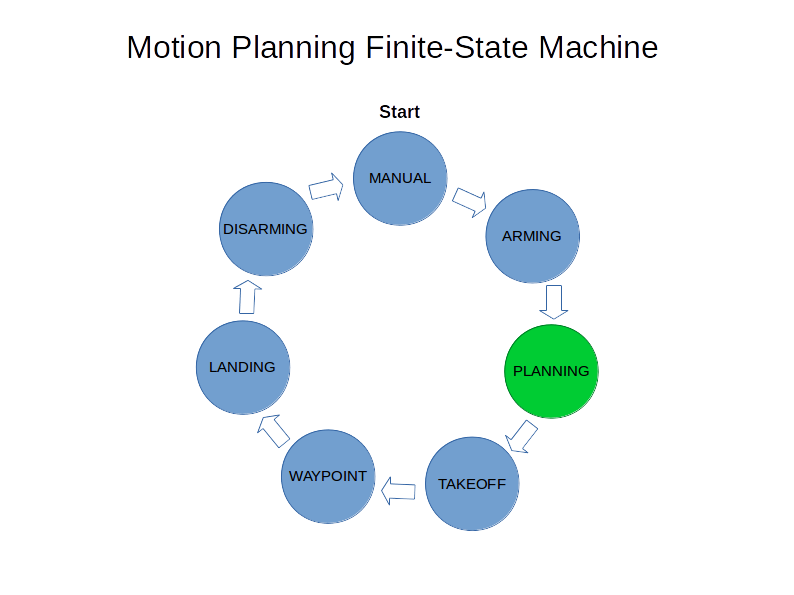
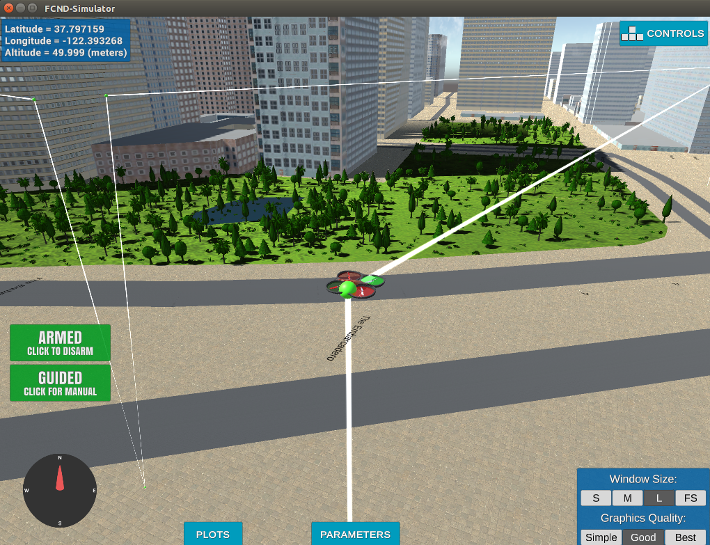

# Unmanned Aerial Vehicles (UAVs) 3D-Motion Planning
<!---

-->

---

This project is a continuation of the Backyard Flyer project, in which the drone executed a simple square shaped flight path. In this project, I have implemented a motion planning algorithm, which enables the drone to fly through the simulated city of San Francisco, CA, from a start location to a specified goal (latitude-longitude) location on the map.

## The 3D-Motion Planning algorithm follows the below general flow:

1. Loads the 2.5D map provided in the colliders.csv file describing the environment.
2. Discretizes the environment into a graph representation.
3. Defines the start and goal locations.
4. Performs a graph route search using the A* algorithm.
5. Optimizes/Prunes the graph path to remove unnecessary waypoints.
6. Uses the waypoints in local ECEF coordinates [N, E, altitude, heading] to autonomously fly the drone from start to goal.

## Source Files
Final 3D-Motion Planning project source files:

1. [motion_planning.py](./motion_planning.py)
2. [route_planner.py](./route_planner.py)

Starter Code source files:
1. [motion_planning_starter_code.py](./motion_planning_starter_code.py)
2. [planning_utils.py](./planning_utils.py) (grid based route)


## Project Implementation

### Here I will consider the Udacity [Rubric](https://review.udacity.com/#!/rubrics/1534/view) Points individually and describe how I addressed each point in my implementation, giving references to respective code segments.  

### Starter Code
---
<i><b>Note:</b> This Starter Code section talks only about the starter code, which can be found in `motion_planning_starter_code.py`. The `motion_planning.py`, which is built upon the starter code, contains the final motion planning algorithm and is discussed later.</i>

To start with, I used a slightly modified version of the [Backyard Flyer Project](https://github.com/ashishsnaik/FCND-Backyard-Flyer-P1) code, as a starting point. Below, I briefly explain the fundamental difference between the original backyard flyer code and starter code, and provide a concise description of the functionality of the starter code used to develop this project.

At it's foundation, the overall system functions as a finite-state machine (FSM) and is implemented in the `motion_planning_starter_code.py` source file. The `planning_utils.py` contains various utility functions used by the starter code for path planning.

#### <b>Functionality of `motion_planning_starter_code.py` and `planning_utils.py`</b>

These two scripts contain the basic motion planning implementation. 



The `backyard_flyer_solution.py` implementation autonomously flew the drone in a square formation and used six functional states for the drone: <b>Manual, Arming, Takeoff, Waypoint, Landing, and Disarming</b>. The starter code for this Motion Planning project adds an additional <b>Planning</b> state between the <b>Arming</b> and <b>Takeoff</b> states, as indicated in green color in the above state machine diagram. In the Planning state, the autopilot handles the path planning, as implemented in the <i>plan_path(...)</i> method of <i>class MotionPlanning</i> in `motion_planning_starter_code.py`.

The Backyard Flyer project calculated the waypoints after Takeoff and before entering the Waypoint state, whereas in the Motion Planning project starter code, the waypoints are determined, before Takeoff, in the Planning state, based on a path searched through a grid using the <b>A-star</b> algorithm. Using these waypoints, in the starter code, the drone follows a jerky zig-zag path to the northeast for about 10 meters, before landing.

The starter code path planning algorithm implemented in the <i>plan_path(...)</i> method behaves as follows:
1. Creates a grid representation of a 2D configuration space based on given obstacle data, drone altitude, and required safety distance - <i>create_grid(...)</i> function in `planning_utils.py`.
2. Defines starting point on the grid (this is just the grid center).
3. Sets goal (point) as some arbitrary position on the grid.
4. Runs A* to find a path from start to goal - <i>a_star(...)</i> algorithm in `planning_utils.py`.
5. Converts the path to zig-zag waypoints for the drone to follow.

**Important functions in planning_utils.py**

<b>*create_grid(...)*</b>

This function creates, based on the obstacles data, a 2-d empty grid with size equivalent to the vertical North-South coordinate range and horizontal East-West coordinate range. It then populates appropriate grid cells with 1s indicating the obstacles and the required safety range, essentially providing a 2-d map of the configuration space with free and infeasible points for the drone to plan it's path.

<b>*a_star(...)*</b>

This function implements the A* algorithm using four possible actions (*Action enum*) - North, South, West, North to determine the valid actions - *valid_action(...)* function - that can be taken from a particular cell. For cost calculation, it adds an Eucledian-norm heuristic to the action cost.

*<b>Note:</b> the diagonal actions in the Action enum are added later and were not part of the started code.*

### 3D Path Planning Algorithm
---


In this section I describe different aspects of the 3D Path Planning algorithm.

#### **Drone Position**

The code keeps track of two major drone positions: global home position and current local position, which is relative to the global home position.

*Global Home Position*

The first line of the [colliders.csv](./colliders.csv) file contains the lat0 and lon0 as floating point values, which represent the latitude and longitude of the map center, and also the drone's global home position. The *\_\_init__* method of *class MotionPlanning* reads and records this location, and the *plan_path(...)* method sets it as the global home using the *Drone* super-class's *set_home_position()* method.

*Current Local Position*

The current local position is determined in the *plan_path(...)* method by using the current global position and udacidrone's *global_to_local(...)* utility function.

#### **Start and Goal Positions**

The start position for the drone is always it's current local position as determined by the *plan_path(...)* method.

The user can input the goal location (global latitude and longitude location within the map) as command line parameters. If not specified by the user, the program uses a default lat/lon goal location which is close to the map center. The goal lat/lon location is converted to a local North-East-Altitude goal location with reference to the home position using udacidrone's *global_to_local(...)* utility function.

*<b>Note:</b> Currently, the Goal (as well as the Start) location altitude is restricted to Zero (ground level).*

#### <b>A\* Graph Search Algorithm</b>

The actual 3D-Motion Planning algorithm is implemented by *class RoutePlanner* in `route_planner.py`. The *RoutePlanner* works with the local ECEF (earth-centered, earth-fixed) coordinate system [North, East, Altitude, Heading].

The *\_\_search_path(...)* method of *class RouterPlanner* in `route_planner.py` implements a modified version of the A* search algorithm that works on a pre-built *NetworkX* route graph. During initialization, The *RoutePlanner* builds a *NetworkX* route graph, by sampling map points at a specified altitude, as nodes, and determining the node connectivities with respect to the obstacle data in the [colliders.csv](./colliders.csv) file. Euclidean distance between two connected graph nodes is used as edge weights. 

To incrementally calculate the path cost, the A* graph search algorithm uses the edge weights plus a heuristic function, which is the distance to the goal node from a specific node.

The closest graph nodes that are connectable to the start and the goal N-E-Alt map locations are chosen as the Graph Start and Graph Goal Nodes, respectively. 

Once the graph path is found, the initial, complete, flight path can be described as below **Waypoints**:

**Map Start Location** (Ground Level) &#x27A1; **Map Start Location** (Target Altitude) &#x27A1; **Graph-Path Start Node** &#x27A1; **\[graph path waypoints\]** &#x27A1; **Graph-Path Goal Node** &#x27A1; **Map Goal Location** (Target Altitude) &#x27A1; **Map Goal Location** (Ground Level)



#### **Path Pruning**

The above complete flight path is then pruned of unnecessary waypoints. This is accomplished by the *RoutePlanner* class's *\_\_prune_path_and_orient(...)* and *\_\_can_connect(...)* methods. 

The *\_\_prune_path_and_orient(...)* method iteratively checks for the farthest possible waypoint that can be connected by a straight line without colliding with an obstacle. The *\_\_can_connect(...)* method uses the  *object.crosses(...)* method of `shapely.geometry.Polygon` class to check for collision and is optimized to check for colisions only with obstacle polygons in the vicinity of the line.

The method also programs the drone orientation/heading for every inter-waypoint trajectory.

*<b>Presently the Drone's Start and Goal locations are restricted to open ground locations only - cannot be on rooftops, for example.</b>*

### Executing The Flight
---


*<b>Note: Please refer the README file for the python environment and project execution setup.</b>*

Run the [Udacity Simulator](https://github.com/udacity/FCND-Simulator-Releases/releases/tag/v0.1.1-sim) and select *Motion Planning*.

To execute the drone flight from the command line use the below commands from the project root folder.

Activate the FCND environment

```
> source activate fcnd
```

Command the Drone to fly to a Latitude/Longitute goal location on the simulator.

```
> python motion_planning.py -l <latitude> <longitude>
# example
> python motion_planning.py -l 37.797423 -122.401399
```

The latitude/longitude location should be a valid location on the simulated map, i.e. in the below ranges:

Lat/Lon | Min | Max
--- | --- | ---
Latitude | 37.78966453206827 | 37.79790277484265
Longitude | -122.40251813469173 | -122.39200186357762

This [textfile](./lat_lon_sample_locations.txt) contains a few 'lat lon' open locations. 

Use `-h` or `--help` for parameter help.
```
> python motion_planning.py --help
```

*<b>Note:</b> There seems to be a non-critical glitch in the [Udacity v0.1.1 Simulator](https://github.com/udacity/FCND-Simulator-Releases/releases/tag/v0.1.1-sim). The drone's initial start location is under/inside a structure/obstacle, so during takeoff the drone shoots-off upwards while ascending through the "obstacle roof", but then stabalizes and continues with the planned path to flight completion. This issue is only for the first flight; subsequent flights should run smoothly.*
